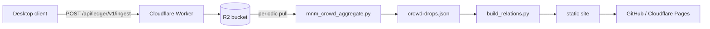

# Deployment (Phase A: local-first + optional ingest)

Phase A keeps the project local-first: a hosted **static site** for lookups and an optional
**serverless ingest endpoint** that simply stores opt-in upload payloads for later offline
aggregation. No accounts, no live database yet (that's Phase B — see
[`aggregation_service`](PROVENANCE.md)).



## 1. Host the static site

The UI is entirely in `site/`. Deploy that directory as the web root.

### GitHub Pages (provided)

[`.github/workflows/deploy-site.yml`](.github/workflows/deploy-site.yml) rebuilds the bundles
(`build_relations.py` + `build_site.py`) and publishes `site/` on every push to `main`. Enable
it once: repo **Settings -> Pages -> Source: GitHub Actions**.

### Cloudflare Pages (alternative)

Create a Pages project from the repo with:
- Build command: `pip install -r requirements.txt && python build_relations.py && python build_site.py`
- Build output directory: `site`

## 2. Stand up the ingest endpoint

A minimal Cloudflare Worker in [`workers/ingest/`](workers/ingest/) accepts the
`mnm-ledger-upload/v2` payload, validates + rate-limits it, and stores it to R2.

```
npm i -g wrangler
cd workers/ingest

# one-time resources
wrangler r2 bucket create mnm-ledger-payloads
wrangler kv namespace create RATE          # paste the id into wrangler.toml

wrangler deploy
```

Optional hardening:
- Require a token: `wrangler secret put INGEST_TOKEN` and set `ALLOW_ANONYMOUS = "0"`.
- Tune `MAX_BYTES` and `RATE_PER_HOUR` in `wrangler.toml`.

Endpoints:
- `GET  /api/ledger/v1/health` -> `{ ok, schema }`
- `POST /api/ledger/v1/ingest` -> `202 { accepted, batch_id, stored }`

## 3. Wire the client to the endpoint

In the desktop client **Settings** (or `config/ledger.env`):

```
MNM_UPLOAD_URL=https://mnm-ingest.<subdomain>.workers.dev/api/ledger/v1/ingest
# MNM_UPLOAD_TOKEN=...           # only if you set INGEST_TOKEN
# MNM_UPLOAD_SHARE_CHARACTERS=0  # keep anonymous by default
```

The client's "Submit data" button (or `python mnm_ledger_upload.py --upload`) now POSTs.

## 4. Turn stored payloads into crowd data

Pull the R2 objects into an inbox and aggregate (this is the manual Phase A loop; Phase B
automates it server-side):

```
wrangler r2 object get mnm-ledger-payloads --prefix payloads/ ...   # sync to data/crowd-inbox/
python mnm_crowd_aggregate.py        # -> data/crowd-drops.json, data/crowd-kills.json
python build_relations.py            # merges via_crowd + recomputes confidence/conflict
python build_site.py                 # publishes refreshed bundles
```

See [PRIVACY.md](PRIVACY.md) for what the payload contains and the data-handling rules.
