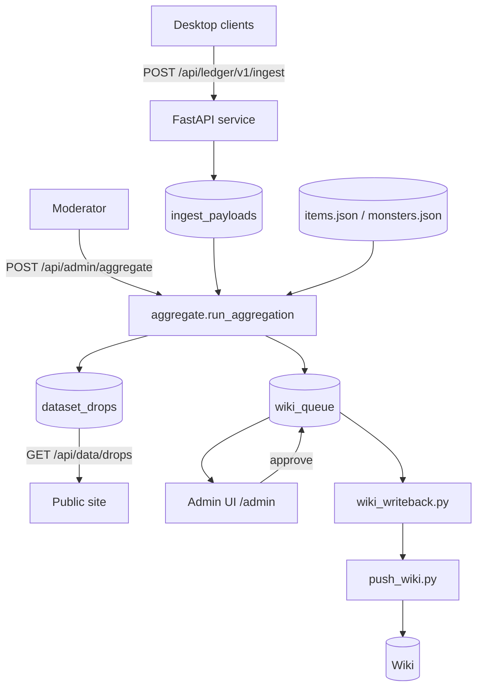

# Phase B — Hosted Service

The full service: ingest API + shared DB + auth, an aggregation/trust engine that produces the
public dataset, and a moderated wiki write-back pipeline with an admin conflict-resolution view.
It reuses the exact offline scoring/dedup logic ([`mnm_provenance.py`](mnm_provenance.py),
[`mnm_crowd_aggregate.py`](mnm_crowd_aggregate.py), [`build_relations.py`](build_relations.py)) so
local and server results stay identical.



## Run

```
pip install -r server/requirements.txt
export MNM_ADMIN_TOKEN=$(openssl rand -hex 16)     # required for /api/admin/*
uvicorn server.app:app --port 8000
```

Open `http://localhost:8000/admin` for the conflict-resolution UI.

## Auth / identity

- **Contributors**: anonymous opaque `install_id` (no accounts in step 1).
- **Moderators**: shared `MNM_ADMIN_TOKEN` bearer token guards every `/api/admin/*` route.
- **Ingest**: open by default; set `MNM_INGEST_TOKEN` (+ `MNM_ALLOW_ANONYMOUS=0`) to require a token.
- **Planned**: Discord OAuth for per-user/guild accounts slots in behind the same `require_admin`
  dependency without changing the data model.

## Endpoints

| Method | Path | Auth | Purpose |
|---|---|---|---|
| GET | `/api/ledger/v1/health` | — | liveness + stats |
| POST | `/api/ledger/v1/ingest` | optional token | store an upload payload (idempotent by `batch_id`) |
| GET | `/api/data/stats` | — | public counts |
| GET | `/api/data/drops` | — | public scored dataset (filter by `status`) |
| DELETE | `/api/data/install/{id}` | self (knows id) | right-to-be-forgotten |
| POST | `/api/admin/aggregate` | admin | recompute dataset + wiki candidates |
| GET | `/api/admin/conflicts` | admin | crowd-candidate edges (wiki gaps) |
| GET | `/api/admin/wiki-queue` | admin | pending/approved/rejected queue |
| POST | `/api/admin/wiki-queue/{id}/decide` | admin | approve / reject |
| GET | `/api/admin/wiki-export` | admin | approved edits for write-back |

## Aggregation / trust engine

`server/aggregate.py::run_aggregation()`:
1. loads all non-deleted payloads,
2. unions dedup tokens across users (`mnm_crowd_aggregate.aggregate`),
3. scores edges against wiki data (`build_relations.build_drops` + `mnm_provenance.score_edge`),
4. writes `dataset_drops`, and queues `crowd_candidate` edges (>=2 observations) as
   `add_drop` candidates in `wiki_queue`.

Run it on a schedule (cron / a worker) or on demand from the admin UI.

## Moderated wiki write-back

1. Moderator reviews conflicts in `/admin` and approves real wiki gaps.
2. `python wiki_writeback.py` exports approved edits to `data/wiki-writeback-queue.json`.
3. A human generates page wikitext and publishes with the existing
   `python push_wiki.py --page "..." --file ...` — the wiki is never edited automatically.

## Schema versioning / migrations

`server/db.py` keeps a `schema_version` table and a forward-only `MIGRATIONS` list; bump
`SCHEMA_VERSION` and append a migration. The ingest payload contract is versioned separately
(`mnm-ledger-upload/v1|v2`); both are accepted. For production, swap the SQLite `connect()` for
Postgres — the schema is portable.

## Production notes

- Put the service behind HTTPS (the same domain as the static site or a subdomain).
- Move SQLite -> Postgres for concurrency; keep WAL only for the single-node reference.
- See [PRIVACY.md](PRIVACY.md) for data handling and [DEPLOY.md](DEPLOY.md) for Phase A hosting.
